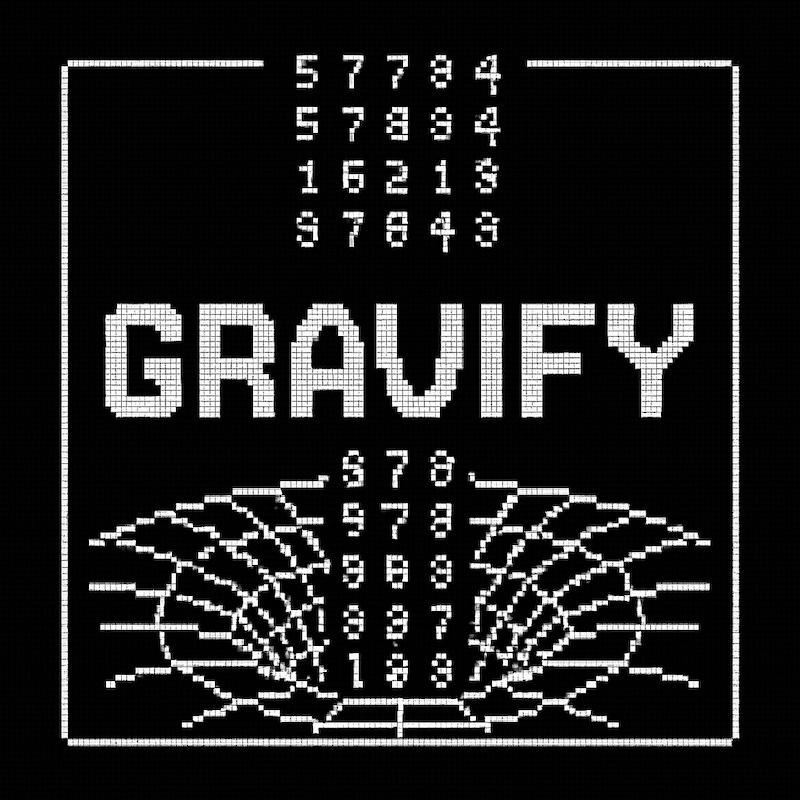
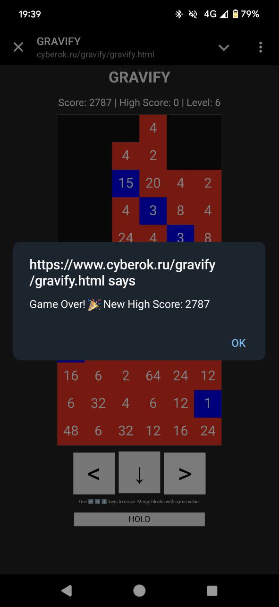

# Gravify

**Gravify** is a minimalist, block-merging puzzle game built around the psychological principles behind classic gameplay. Inspired by timeless classics like **Tetris** and **Snake**, Gravify challenges your attention, reflexes, and pattern recognition — not with cinematic cutscenes, but with pure gameplay satisfaction.

## 🔥 Play It Now
👉 [Try Gravify Online](https://www.cyberok.ru/gravify/gravify.html)

## 🎮 How to Play

- Use **⬅️ ➡️ ⬇️** arrow keys (or on-screen controls) to move falling number blocks.
- Merge blocks of the **same value** to create higher numbers.
- The merged value replaces one block; others are cleared.
- Score points and level up as you merge and survive.
- Each level increases difficulty and slightly speeds up the game.

> Red blocks are **even**, blue blocks are **odd**. Visual contrast helps cognitive load balancing.

## 📷 Screenshots

### Gameplay

## 🧠 Project Philosophy

Gravify is part of a broader project exploring **psychological principles behind classic games**.

> *"While AAA games compete with Hollywood, classics like Tetris and Snake remain undefeated — not by graphics, but by gameplay."*

In a time of cinematic excess and billion-dollar budgets (e.g. GTA 6, Star Citizen), Gravify returns to the **essence of fun**: simple mechanics that are easy to learn, hard to master, and infinitely replayable.

This game is:
- **Minimalist**: Built in pure HTML5/JavaScript with no dependencies.
- **Tactile**: Sound and color feedback reinforce key gameplay events.
- **Accessible**: Responsive layout for mobile and desktop play.

## 🧩 Features

- Progressive difficulty via **levels and speed scaling**
- **Local high score** tracking (via `localStorage`)
- Built-in **sound effects** and **music**
- **Responsive controls** for mobile and desktop
- Simple **canvas-based rendering** for maximum compatibility

## 🛠️ Code Overview

The game is a single-file HTML+JS implementation (`gravify.html`):
- `canvas`: Rendering grid and game blocks
- `grid[][]`: Stores current block values
- `createNewPiece()`: Generates new falling number
- `mergeRecursive()`: Handles merging logic
- `applyGravity()`: Makes blocks fall after merge
- `tick()`: Main game loop

## 🧠 Inspiration

This project reflects on **why simple games stay timeless**. It is an invitation to developers and designers to:
- Strip down to **core mechanics**
- Leverage **visual cognition** and **reward loops**
- Create games that **feel good**, not just look good

## 🚀 Future Ideas

- Online leaderboard integration
- New block types (e.g. "wildcard" blocks)
- Accessibility tweaks (e.g. high-contrast mode)
- AI-based player analysis (tie-in with psychology research)

---

**Enjoy Gravify** — where every merge counts, and gameplay is king.

🧠🎮🧩
